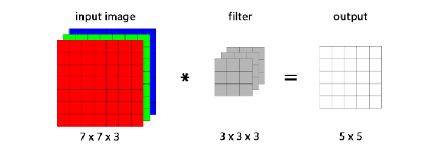

# Implementation of Convolution 2D Layer 

## Overview
In Image Processing, Convolution layers are the basic operator for performing various tasks such as Filtering, Edge Detection, Blurring and Feature Extraction. The process of Convolution 2D layer invloves applying kernel to the input image to obtain the "Convoluted Image". 

## General Steps of Convolution 2D
1. Place the kernel on the input image 
2. Multipe each pixel in the kernel to the corrsponding pixel in the input image 
3. Sum up the element-wise multipled results
4. Slide the kernel to the next pixel and repeat the process until the entire image is covered.

## Project Overview
The logic and math of convolution layer are replicated in the programming languages such as C++ and Python. In order to improve the performance and effiency of the computation, the multi-threaded C++ program was implemented and the performance was compared with the non threaded C++ and python codes. 

<div style="text-align:center"></div>
<br/>

The image explains the application of Convolution-2D over multi-channel image and in the implementation which the project carries follows the steps mentioned below, 

1. The input image is padded with the respective to the kernel size 
2. Padded image is applied with the convolution 2D which can handle multi-channel 
3. Basic blur kernel of 3 x 3 is used in the implementation 
4. Multi-threading / parallelism is handled my the OpenMP library 


### Requirements
- For python install the below required packages in your workspace 
```Bash
$ pip3 install -r requirements.txt
```
- The C++ version of code requirement OpenCV header files, which can be build from source

### Project Execution
Entire project can be executed by a single command which holds the underlying 3 different implementation of Convolution 2D<br/>

```Bash
$ python3 main.py ../Convolution2D/images/sample.jpg
```
the main python script takes the image path from the commandline and distributes the image source to the underlying codes. The entire process of execution is automated and the "Convoluted Images" will be saved in the <b>output</b> folder with the executed code type as the name of it

### Note
- The input image is assumed to be 3 or Multi-channel input 
- padding is done by the formula (kernel - 1) / 2
